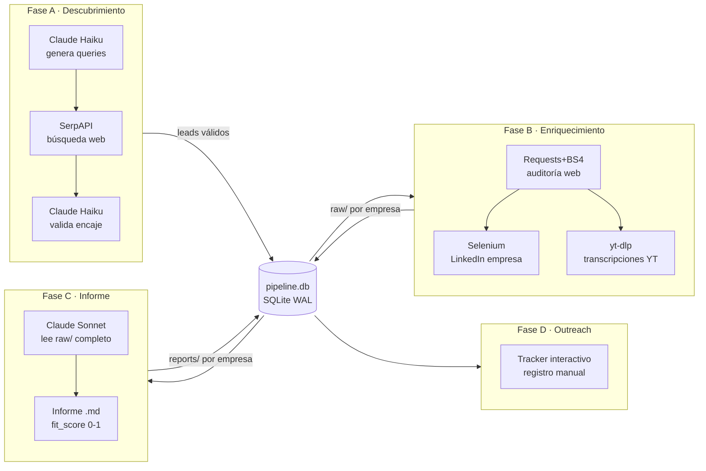
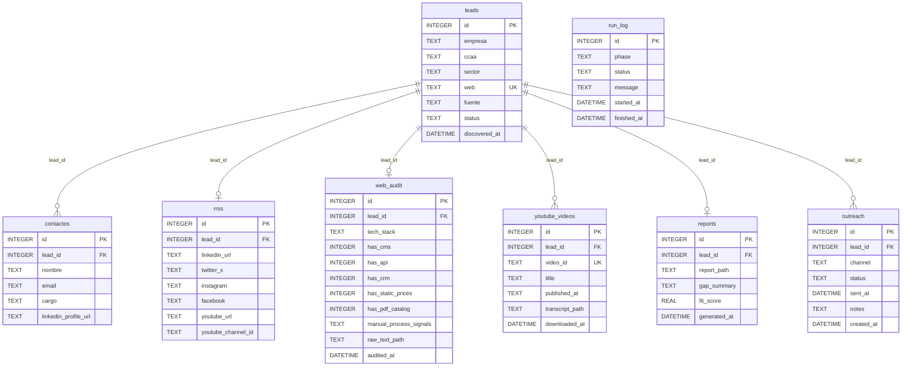
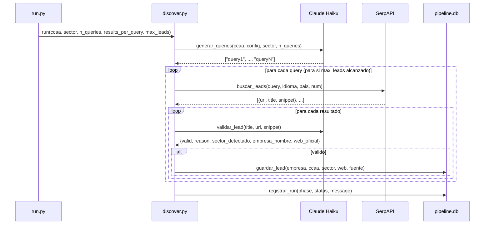

# TECHNICAL.md — Documentación técnica de Prospector B2B

Descripción detallada de la arquitectura, ficheros, funciones y flujo de datos.
Para el historial de construcción, ver [JOURNAL.md](JOURNAL.md).
Para las decisiones de diseño, ver [DECISIONS.md](DECISIONS.md).

---

## Arquitectura general

El pipeline se estructura en 4 fases independientes y encadenadas. Cada fase lee de la BD el output de la fase anterior y escribe su propio output. Esto permite ejecutar fases por separado y relanzar cualquiera sin repetir las anteriores.



---

## Estructura de ficheros

```
prospector/
├── db/
│   ├── schema.sql          — definición de tablas SQLite
│   └── init_db.py          — crea data/pipeline.db aplicando schema.sql
├── pipeline/
│   ├── config.py           — constantes globales, rutas y PERFIL del developer
│   ├── run.py              — punto de entrada CLI (--phase, --ccaa, --lead-id...)
│   ├── phase_a/
│   │   └── discover.py     — descubrimiento y validación de leads
│   ├── phase_b/
│   │   ├── web_audit.py    — auditoría web, detección de stack y RRSS
│   │   ├── linkedin.py     — scraping de página pública de empresa en LinkedIn
│   │   └── youtube.py      — descarga de transcripciones de canal YouTube
│   ├── phase_c/
│   │   └── report.py       — generación de informe estructurado con LLM
│   └── phase_d/
│       └── outreach.py     — tracker interactivo de contactos realizados
├── data/
│   ├── pipeline.db         — base de datos local (gitignored)
│   └── raw/
│       └── {lead_id}/
│           ├── web.txt         — texto extraído de la web corporativa
│           ├── linkedin.txt    — contenido scrapeado de LinkedIn
│           └── youtube/
│               └── {video_id}.txt  — transcripción por vídeo
├── reports/
│   └── {lead_id}.md        — informe generado por LLM (gitignored)
├── docs/
└── requirements.txt
```

---

## Base de datos: pipeline.db

SQLite en WAL mode. Permite lecturas concurrentes durante escrituras, evitando bloqueos si en el futuro el pipeline corre en paralelo. Ver decisión 002 en DECISIONS.md.

### Diagrama entidad-relación



### Estados del campo `leads.status`

| Status | Significado |
|---|---|
| `pending` | Lead descubierto, sin enriquecer |
| `enriching` | En proceso de enriquecimiento (Fase B en curso o parcial) |
| `reported` | Informe generado (Fase C completada) |
| `contacted` | Primer contacto realizado |

---

## pipeline/config.py

Constantes globales cargadas una sola vez al importar el módulo.

| Constante | Tipo | Descripción |
|---|---|---|
| `BASE_DIR` | str | Raíz del proyecto (directorio padre de `pipeline/`) |
| `DB_PATH` | str | Ruta absoluta a `data/pipeline.db` |
| `RAW_DIR` | str | Ruta absoluta a `data/raw/` |
| `REPORTS_DIR` | str | Ruta absoluta a `reports/` |
| `LLM_API_KEY` | str | Clave Anthropic leída de `.env` |
| `SERPAPI_KEY` | str | Clave SerpAPI leída de `.env` |
| `LINKEDIN_EMAIL` | str | Email LinkedIn leído de `.env` |
| `LINKEDIN_PASSWORD` | str | Contraseña LinkedIn leída de `.env` |
| `PERFIL` | str | Bloque de texto con el perfil del developer, usado en prompts LLM |

---

## pipeline/run.py — Punto de entrada CLI

### Argumentos

| Argumento | Tipo | Default | Aplica a | Descripción |
|---|---|---|---|---|
| `--phase` | A/B/C/D | obligatorio | todas | Fase a ejecutar |
| `--ccaa` | str | `catalunya` | solo A | CCAA objetivo |
| `--sector` | str | None | solo A | Sector específico (opcional) |
| `--lead-id` | int | None | B, C | Procesar un lead concreto |
| `--queries` | int | 8 | solo A | Queries a generar |
| `--results` | int | 10 | solo A | Resultados SerpAPI por query |
| `--max-leads` | int | None | solo A | Techo de leads válidos |
| `--lang` | str | `es` | solo B | Idioma subtítulos YouTube |
| `--max-videos` | int | 20 | solo B | Máx vídeos a transcribir por canal |

---

## pipeline/phase_a/discover.py — Descubrimiento de leads

### Propósito
Descubrir PYMEs y startups potencialmente cliente a través de SerpAPI, validar su encaje con el perfil del developer mediante LLM y guardarlas en `leads`.

### Diagrama de secuencia



### Constante: CCAA_CONFIG
Diccionario estructurado por CCAA con `idioma` (código ISO 639-1 para SerpAPI `hl=`), `pais` (código ISO 3166-1 para SerpAPI `gl=`) y `geo` (términos geográficos para las queries).

### Constante: SECTORES_OBJETIVO
Lista de 18 sectores objetivo preconfigurados. Se usan cuando no se especifica `--sector`. El LLM combina estos sectores con la geografía para generar queries diversas.

### Función: limpiar_json(texto)
Elimina bloques de markdown (` ```json ... ``` `) del texto devuelto por el LLM antes de parsear con `json.loads()`. Necesaria porque Claude Haiku envuelve habitualmente las respuestas JSON en markdown. Ver la misma función en BioPlace/discover.py — comportamiento idéntico.

### Función: generar_queries(client, ccaa, config, sector, n_queries)
Prompt al LLM que genera `n_queries` queries de búsqueda combinando CCAA, sectores objetivo, tipo de empresa y operadores de exclusión de RRSS y PDFs. Devuelve lista de strings.

**`max_tokens`:** 1024 — necesario para n_queries > 5.
**Modelo:** `claude-haiku-4-5-20251001`.

### Función: buscar_leads(query, idioma, pais, num)
Llama a SerpAPI REST con los parámetros geográficos de la CCAA. Extrae `link`, `title` y `snippet` de los resultados orgánicos. 1 llamada a SerpAPI por invocación.

### Función: validar_lead(client, title, url, snippet)
Prompt de clasificación: el LLM evalúa si la empresa encaja con el PERFIL del developer. Devuelve JSON con `valid` (bool), `reason`, `sector_detectado`, `empresa_nombre` y `web_oficial` (URL de la web corporativa si la detección en el snippet la revela — útil cuando el resultado de SerpAPI apunta a una ficha de directorio).

**`max_tokens`:** 256.

### Función: guardar_lead(empresa, ccaa, sector, web, fuente)
`INSERT OR IGNORE` en `leads`. La constraint `UNIQUE` sobre `web` evita duplicados entre ejecuciones.

---

## pipeline/phase_b/web_audit.py — Auditoría web

### Propósito
Descargar la web corporativa, detectar stack tecnológico, señales de proceso manual y URLs de redes sociales. Guardar el texto extraído en `data/raw/{lead_id}/web.txt`.

### Constante: CMS_PATTERNS
Dict de CMS → lista de patrones regex. Detecta: WordPress, Shopify, Wix, Squarespace, Webflow, Joomla, Drupal, PrestaShop, Magento.

### Constante: SOCIAL_PATTERNS
Dict de campo → regex para extraer URLs de LinkedIn, Twitter/X, Instagram, Facebook y YouTube directamente del HTML de la web. Fuente más fiable que SerpAPI para encontrar el canal YouTube correcto.

### Función: detectar_stack(html_lower, response_headers)
Extrae tech stack de cabeceras HTTP (`Server`, `X-Powered-By`) y del HTML (React, Vue.js, Next.js, Angular). Devuelve string con los elementos encontrados separados por `, `.

### Función: detectar_rrss(html)
Aplica `SOCIAL_PATTERNS` sobre el HTML completo. Devuelve dict con los campos encontrados. Solo incluye campos con valor — no devuelve nulls.

### Función: detectar_senales(html_lower, soup)
Detecta señales de proceso manual y madurez digital: catálogos PDF, precios visibles, contacto por WhatsApp, ausencia de e-commerce, formularios de contacto, presencia de CRM (HubSpot, Salesforce, Zoho, etc.), texto "solicitar presupuesto". Devuelve lista de strings.

### Función: guardar_rrss(lead_id, rrss)
`INSERT OR IGNORE` para crear la fila si no existe, seguido de `UPDATE` por campo. Los nombres de campo se validan contra `RRSS_WHITELIST` antes de usarlos en la query SQL — previene inyección aunque el dict proceda de código interno.

---

## pipeline/phase_b/linkedin.py — Scraping LinkedIn

### Propósito
Scraping ligero de la página pública de empresa en LinkedIn usando Selenium con sesión autenticada. Solo información públicamente visible para cualquier usuario logueado. Guarda el contenido en `data/raw/{lead_id}/linkedin.txt`.

### Por qué Selenium y no requests
LinkedIn renderiza el contenido de las páginas de empresa con JavaScript. Requests solo obtiene el HTML inicial, sin el contenido dinámico. Selenium con Chrome headless renderiza la página completa.

### Función: init_driver()
Inicia Chrome con flags anti-detección: `--disable-blink-features=AutomationControlled`, `excludeSwitches: enable-automation`, `useAutomationExtension: false`, User-Agent real. Desactiva la propiedad `navigator.webdriver` via JavaScript. Ver decisión 004 en DECISIONS.md.

### Función: login(driver)
Login en linkedin.com/login con las credenciales de `.env`. Añade delays aleatorios entre acciones (2-4s, 0.5-1.5s) para comportamiento similar al humano.

### Función: scrape_company(driver, linkedin_url)
Extrae: descripción/about, datos de empresa (tamaño, sector, web), especialidades y últimos 5 posts. Incluye scroll para cargar el feed de posts. Devuelve texto plano estructurado con encabezados markdown.

**Nota sobre selectores:** LinkedIn modifica su DOM con frecuencia. Si los selectores dejan de funcionar, ver decisión 004 en DECISIONS.md para el procedimiento de actualización.

### Delays entre empresas
Entre 6 y 12 segundos aleatorios entre scrapes de empresas distintas. No hay patrón fijo que LinkedIn pueda detectar como bot.

---

## pipeline/phase_b/youtube.py — Transcripciones YouTube

### Propósito
Descargar transcripciones de los vídeos de un canal YouTube usando yt-dlp. Guarda cada transcripción en `data/raw/{lead_id}/youtube/{video_id}.txt` y registra los metadatos en `youtube_videos`.

### Por qué yt-dlp y no youtube-transcript-api
yt-dlp descarga tanto subtítulos manuales como automáticos y soporta múltiples idiomas con fallback. Coherente con el script bash existente (`full_pipeline.sh`) que el developer ya usa para RAG personal.

### Función: vtt_a_texto(contenido_vtt)
Equivalente Python de la función `subs_to_text` del script bash original. Elimina cabeceras WEBVTT, timestamps, tags HTML, entidades HTML y líneas duplicadas consecutivas. Añade saltos de párrafo en puntuación final.

### Función: obtener_videos_canal(channel_url, max_videos)
Usa `extract_flat='in_playlist'` con `playlistend=max_videos` para obtener metadatos de vídeos sin descargar. Devuelve lista de dicts con `id`, `title` y `url`.

### Función: descargar_transcript(video_url, lang)
Intenta subtítulos manuales primero, automáticos como fallback. Prioridad de idiomas: `lang` → `{lang}-ES` → `ca` → `en`. Usa directorio temporal (`tempfile.TemporaryDirectory`) para los ficheros VTT intermedios — se limpian automáticamente al salir del contexto.

**Por qué directorio temporal:** yt-dlp escribe ficheros intermedios en disco. Usando `tempfile` garantizamos que no quedan residuos aunque el proceso falle.

---

## pipeline/phase_c/report.py — Generación de informes

### Propósito
Leer todo el contenido raw de una empresa, enviarlo a Claude Sonnet y generar un informe estructurado en markdown con perfil, gaps, encaje y fit_score.

### Función: cargar_contenido(lead_id)
Lee `web.txt` (máx 6000 chars), `linkedin.txt` (máx 4000 chars) y hasta 5 transcripciones de YouTube (máx 2000 chars cada una). Los límites controlan el consumo de tokens del LLM. Devuelve dict con las claves disponibles — no incluye fuentes ausentes.

### Función: generar_informe(client, empresa, web, contenido)
Prompt a Claude Sonnet que incluye el PERFIL completo del developer y todo el contenido disponible. Solicita informe con 7 secciones fijas: perfil, madurez digital, gaps, encaje, soluciones, fit_score y gancho para el primer contacto.

**Modelo:** `claude-sonnet-4-6` — razonamiento más profundo necesario para síntesis y análisis cruzado de múltiples fuentes.
**`max_tokens`:** 2048.

**Extracción del fit_score:** regex sobre el texto generado busca `FIT_SCORE: [0.0-1.0]`. Si no encuentra el patrón, devuelve 0.5 como valor neutro. El score se clampea a [0.0, 1.0] como garantía.

### Sección 7 — Gancho para el primer contacto
La sección más importante para el outreach. El LLM genera un detalle concreto y específico (un elemento de la web, un post reciente, un tema recurrente en YouTube) que demuestra análisis real de la empresa. Es el diferenciador frente al outreach genérico.

---

## pipeline/phase_d/outreach.py — Tracker de outreach

### Propósito
Interfaz interactiva para consultar informes, registrar contactos y hacer seguimiento del estado de cada lead. El outreach es siempre manual — este módulo solo registra y organiza.

### Comandos disponibles

| Comando | Acción |
|---|---|
| `l` | Lista leads filtrados por fit_score mínimo |
| `v` | Muestra el informe completo de un lead |
| `c` | Registra un nuevo contacto (canal + notas) |
| `u` | Actualiza el status de un contacto existente |
| `s` | Sale del tracker |

### Estados de outreach

| Status | Significado |
|---|---|
| `pending` | Pendiente de contactar |
| `sent` | Primer mensaje enviado |
| `replied` | Ha respondido |
| `no_reply` | Sin respuesta tras seguimiento |
| `discarded` | Descartado (no encaja tras más análisis) |
